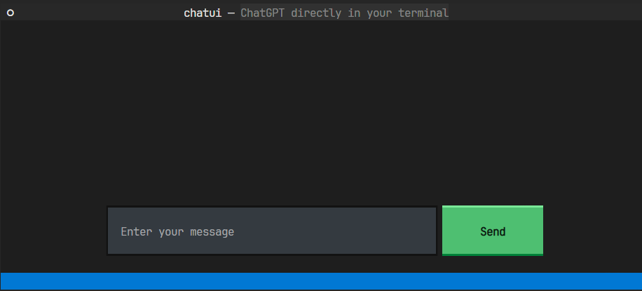

TUI stands for "text user interface". It refers to a type of user interface that relies primarily on text and symbols to interact with users, rather than visual elements like icons and images. TUI applications typically run in a command-line interface (CLI) environment, which is a type of interface where users interact with a computer by typing commands into a text-based interface. TUI applications have been around for a long time and despite their seemingly archaic design, they have certain advantages over graphical user interface (GUI) applications. These include faster response times, lower system requirements, and easier automation.

## Is it really in the terminal?

Several libraries, such as [urwid](http://urwid.org/examples/index.html) or [PyTermGUI](https://ptg.bczsalba.com/), allow the development of TUI applications in Python. For enhancing the functionality and aesthetics of TUI apps, they offer some fundamental and more sophisticated utilities. But there is one package that is truly exceptional and might even be so amazing that it sparks a TUI renaissance (I really wanted to put "TUI renaissance" somewhere in this article).

*Textual* is a package created by Will McGugan, the creator of the `rich`, extremely popular terminal text formatting library. Textual is actually built on top of `rich` to support all of those lovely features, add interactivity to them, and enable the creation of more complicated apps and components. When you first encounter an example of Textual app (and you can find them directly in the Textual [repository](https://github.com/Textualize/textual)), you may wonder: is it really a built-in terminal? Yes, it is.

It's no coincidence that Textual has reached approximately 20k GitHub stars in less than two years. You don't win the hearts of the community by just giving a tool that does something. In the case of Textual, it is obviously much more than that. First and foremost, the code quality is excellent; everything is type-hinted and documented. Another point is how practical and simple Textual is to use. This is because there are so many built-in features. Async support is also included right out of the box. Eventually, working with Textual produces effects that are simply remarkable. In conclusion, you may easily and quickly create the most stunning TUI apps that have ever been seen.

## ChatGPT and Textual

Using Textual to create TUI applications may be an interesting and rewarding experience. Without investing a lot of time in the "frontend" work, you can easily create something usable with an attractive interface. Here, we'll concentrate on `chatui`, an in-terminal ChatGPT app. `chatui` will connect with the ChatGPT engine using the `openai` package, and the interface will be made, of course, with Textual. The most important parts of the project structure will include the following:

```plaintext
chatui
├─ requirements
│  ├─ base.txt
│  └─ dev.txt
├─ chatui
│  ├─ static
│  │  └─ styles.css
│  ├─ __init__.py
│  ├─ chat.py
│  ├─ tui.py
│  ├─ settings.py
│  └─ main.py
└─ Makefile
```

To avoid creating an unnecessary burden, some of the extra information is hidden. Nevertheless, to see how everything is wired, you can find the complete project [here](https://github.com/ttobiwan/chatui).

## Setting up the chat

After creating a new directory and spinning up a new virtual environment, the first thing to deal with is the dependencies. In this case, only two are required: `textual==0.14.0` and `openai==0.27.1`. These should be added to `requirements/base.txt` file, and installed with `pip install -r requirements/base.txt` command.

The OpenAI API key, which is required to communicate with the ChatGPT model, comes next. It can be acquired on the [OpenAI account page](https://platform.openai.com/account/api-keys). Once it's obtained you certainly don't want it to end up in the project repository. Instead, by running `export OPENAI_KEY=key>` it may be loaded as an environment variable, which can then be read in the `chatui/settings.py` file:

```python
import os

OPENAI_KEY = os.environ["OPENAI_KEY"]
```

With that in place, the first step is to develop the actual chat logic. It's not too difficult thanks to the `openai` library. It provides a `ChatCompletion.acreate` method that accepts the name of the AI model and a collection of messages. However, some additional code is required to keep the whole context of the conversation:

```python
import openai

from chatui import settings

openai.api_key = settings.OPENAI_KEY

class Conversation:
    model: str = "gpt-3.5-turbo"

    def __init__(self) -> None:
        self.messages: list[dict] = []

    async def send(self, message: str) -> list[str]:
        self.messages.append({"role": "user", "content": message})
        r = await openai.ChatCompletion.acreate(
            model=self.model,
            messages=self.messages,
        )
        return [choice["message"]["content"] for choice in r["choices"]]

    def pick_response(self, choice: str) -> None:
        self.messages.append({"role": "assistant", "content": choice})

    def clear(self) -> None:
        self.messages = []
```

As a result, the above class keeps track of all messages, and the ChatGPT model is fully aware of the ongoing dialogue. There are a few things worth mentioning. The first is the OpenAI model: `gpt-3.5-turbo`, which powers the ChatGPT and is also recommended for the majority of use cases. Another factor is that messages must include information about the role in addition to text. As a result, the AI model will know who said what. It would be too risky to rely solely on the message order. Finally, the `Conversation` class returns a list of response options. Despite the fact that, in most circumstances (at least in my experience), this list has just one option, the `send` method returns the complete list and allows the user to select the desired option.

It may be difficult to believe, but these 32 lines of code can already execute a genuine dialogue. It can already be seen in action, by creating a `chatui/main.py` file with an alpha version of the app:

```python
import asyncio

from chatui.chat import Conversation

async def main() -> None:
    conversation = Conversation()
    while True:
        msg = input("Type your message: ")
        choices = await conversation.send(msg)
        print("Here are your choices:", choices)
        choice_index = input("Pick your choice: ")
        conversation.pick_response(choices[int(choice_index)])

if __name__ == "__main__":
    asyncio.run(main())
```

Running `python chatui/main.py` can produce the following results:

```console
$ python chatui/main.py
Type your message: Tell a joke
Here are your choices: ['\\\\n\\\\nWhy did the tomato turn red? \\\\nBecause it saw the salad dressing!']
Pick your choice: 0
Type your message: Tell another one
Here are your choices: ['Why did the chicken cross the playground?\\\\nTo get to the other slide.']
Pick your choice: ^C
```


If you have any problems running this script, please make sure to: activate the
virtual environment; export the API key; export the output of `pwd` command as
the `PYTHONPATH` environment variable if any "Module Not Found" error occurs.


This actually already satisfies the functional requirements of `chatui`:

1. Asking questions,
2. Receiving answers,
3. Persisting context.

With chat handling ready, the next step is the user-facing part: TUI.

## Textual in action

Building user interfaces with Textual is done by utilizing classes provided by the library. The base class for creating the app is called (surprisingly) `App` and it is used to connect different components and handle various events and actions. Starting with something simple, `chatui/tui.py` will contain the following code:

```python
from textual.app import App, ComposeResult
from textual.widgets import Footer, Header, Placeholder

class ChatApp(App):
    TITLE = "chatui"
    SUB_TITLE = "ChatGPT directly in your terminal"
    CSS_PATH = "static/styles.css"

    def compose(self) -> ComposeResult:
        yield Header()
        yield Placeholder()
        yield Footer()
```

The Textual app must now be run in place of the CLI chat in the `chatui/main.py` file:

```python
from chatui.tui import ChatApp

if __name__ == "__main__":
    app = ChatApp()
    app.run()
```

With that in place, you can use the `python chatui/main.py` command to launch the app. The expected output is as follows:


This is already quite intriguing. The `ChatApp` class begins with some configuration that will be utilized by the interface. The `compose` method then yields widgets to the parent container. In this scenario, there are three components: `Header` which contains configuration-related information, `Placeholder`, which simply fills the empty space, and `Placeholder`, which is now just a sticker at the bottom. To exit the app, use `CTRL+C` combination.

Even though this is a really simple example, it already opens the door to building something far more powerful.

## Handling input

Core functionality of `chatui` is sending messages. It obviously cannot be done without the ability to take and process input. To make this happen, `chatui` needs to have an `Input` component:

```python
from textual.app import App, ComposeResult
from textual.widgets import Footer, Header, Input, Button
from textual.containers import Container, Horizontal

class ChatApp(App):
    TITLE = "chatui"
    SUB_TITLE = "ChatGPT directly in your terminal"
    CSS_PATH = "static/styles.css"

    def compose(self) -> ComposeResult:
        yield Header()
        with Horizontal(id="input_box"):
            yield Input(placeholder="Enter your message", id="message_input")
            yield Button(label="Send", variant="success", id="send_button")
        yield Footer()
```

The widgets will already be added to the app, but in order for them to resize and position correctly, they require some additional CSS. `static/styles.css` is where styling is stored:

```css
#input_box {
    dock: bottom;
    height: auto;
    width: 100%;
    margin: 0 0 2 0;
    align_horizontal: center;
}

#message_input {
    width: 50%;
    background: #343a40;
}

#send_button {
    width: auto;
}
```

Ultimately, this will result in the interface seen below:



With things looking much better now, a quick recap of what actually happened. First, `Placeholder` widget was replaced with 3 different components. `Horizontal` is a container widget that organizes the items inside it horizontally. Using it as a context manager (`with` keyword) is simply an easier way of passing the widgets to the container `__init__` method. Finally, within the `Horizontal` container, there are `Input` and `Button` widgets, which are quite self-explanatory.

There are a few things worth highlighting in the `static/styles.css` file as well. Aside from standard CSS code, there are other things unique to Textual:

- The `dock: bottom` attribute causes the container to stick to the bottom,
- `height: auto` instructs the container to take only as much height as it needs, rather than occupying the entire area,
- If there is some free space inside the container, `align_horizontal: center` causes the items to move to the center.

Having decent aesthetics is the first step to making this UI usable. Following that, it must actually handle the input. Thankfully, Textual offers a variety of options to handle events occurring within the app:

```python
...  # trunkated imports
from textual.widget import Widget

class ChatApp(App):
    ...  # trunkated code

    async def on_button_pressed(self) -> None:
        await self.process_conversation()

    async def on_input_submitted(self) -> None:
        await self.process_conversation()

    async def process_conversation(self) -> None:
		message_input = self.query_one("#message_input", Input)
        # Don't do anything if input is empty
        if message_input.value == "":
            return
        button = self.query_one("#send_button")

        self.toggle_widgets(message_input, button)

        # Clean up the input without triggering events
        with message_input.prevent(Input.Changed):
            message_input.value = ""

    def toggle_widgets(self, *widgets: Widget) -> None:
        for w in widgets:
            w.disabled = not w.disabled
```

The `on_button_pressed` and `on_input_submitted` methods serve as the starting points for submitting input. They are referred to as "message handlers" in Textual terminology. These methods have three elements to their names:

- `on` indicates that a method is actually a message handler,
- `button` describes the namespace: what produced the message,
- `pressed` names the class of the message - what actually happened.

Because of this naming approach, relatively minimal code is required to handle events within the app. There are two possible messages in this case: input being submitted after clicking the enter button while the input is focused, and the send button being pressed. In a more sophisticated case with many inputs and buttons, the code would have to be more accurate in processing the messages, but because `chatui` only has one of each, it doesn't have to worry about it.

Following that is the `process_conversation` method, which is the root of the app domain logic and is used by both handlers. It doesn't have many responsibilities for now, but there is some intriguing Textual code. It first looks for the `Input` widget by using its id. It is comparable to an ORM searching the database for a certain record. When the input widget is obtained, the code checks to see if it contains any text; if it doesn't, there is no need to perform any more actions. Otherwise, it continues by retrieving the next component: `Button`. There is also a helper method for toggling a list of widgets. In this example, it will deactivate both the input and button components, preventing the user from typing anything while waiting for a response. The method concludes with a code for deleting the text from the input. It uses the `widget.prevent` context manager to prevent events from being emitted when the text inside the input changes.

The handlers do not currently include any chat-related code, but they do respond appropriately and have access to the text and widgets. The next step is to display messages.

## Adding components dynamically

For the chat to be functional, messages need to appear on the screen. Adding content dynamically can often be tricky when working with UI frameworks. However, with Textual it is no rocket science. You only need a container widget to which you will be adding child components. Additionally, `chatui` will also have a custom widget for the message, so that it's a little fancier than just a text:

```python
...  # trunkated imports
from textual.widgets import Footer, Header, Input, Button, Static
from textual.containers import Horizontal, Container

class MessageBox(Widget):
    def __init__(self, text: str, role: str) -> None:
        self.text = text
        self.role = role
        super().__init__()

    def compose(self) -> ComposeResult:
        yield Static(self.text, classes=f"message {self.role}")

class ChatApp(App):
	...  # trunkated code

    def compose(self) -> ComposeResult:
        yield Header()
        yield Container(id="conversation_box")  # 🆕
        with Horizontal(id="input_box"):
            yield Input(placeholder="Enter your message", id="message_input")
            yield Button(label="Send", variant="success", id="send_button")
        yield Footer()

    async def process_conversation(self) -> None:
        message_input = self.query_one("#message_input", Input)
        # Don't do anything if input is empty
        if message_input.value == "":
            return
        button = self.query_one("#send_button")
        conversation_box = self.query_one("#conversation_box")  # 🆕

        self.toggle_widgets(message_input, button)

        # 🆕 Create question message, add it to the conversation and scroll down
        message_box = MessageBox(message_input.value, "question")
        conversation_box.mount(message_box)
        conversation_box.scroll_end(animate=False)

        # Clean up the input without triggering events
        with message_input.prevent(Input.Changed):
            message_input.value = ""
				
		# 🆕 Add answer to the conversation
        conversation_box.mount(
            MessageBox(
                "Answer",
                "answer",
            )
        )

        self.toggle_widgets(message_input, button)
        conversation_box.scroll_end(animate=False)  # 🆕
```

Similarly to the last example, components need a little bit of styling in the `chatui/styles.css` file:

```css
/* ... trunkated styling */

MessageBox {
    layout: horizontal;
    height: auto;
    align-horizontal: center;
}

.message {
    width: auto;
    min-width: 25%;
    border: tall black;
    padding: 1 3;
    margin: 1 0;
    background: #343a40;
}

.question {
    margin: 1 25 1 0;
}

.answer {
    margin: 1 0 1 25;
}
```

The output after launching the app and sending a few messages should be the following:


The conversation UI in the terminal is alive. Well, at least the part about asking questions is alive because the response is for now static. In any case, a little bit of code was added to the app. First goes a widget called `Container`, and it is simply a vertical container for holding additional widgets. As you can see on the screen, it occupies the entire height of the space between the header and the input box. As a result, only that portion is scrollable and the input box is glued to the bottom.

Then, there is a new, custom `MessageBox` widget that serves as a container for the static text. To render the component within properly, it takes two additional parameters. Thanks to that, `Static` widget scales and positions correctly and it has additional styling based on the provided `role` CSS class. With that in place, the `process_conversation` method is now inserting `MessageBox` components into the conversation container, by using `mount` method. Presence of `scroll_end` method is also worth noting - it is used to scroll down to the end of the conversation container whenever a new message appears.

At this point, it appears that `ChatApp` has most of the UI elements and behaviors needed to support a genuine conversation with the ChatGPT. The following step is to connect it with the previously developed `Conversation` class.

## Connecting TUI with ChatGPT

Now that the UI is complete, ChatGPT can be finally integrated into the TUI. The `ChatApp` class must use the actual `Conversation` instance to accomplish this:

```python
...  # trunkated imports
from chatui.chat import Conversation

...  # trunkated code

class ChatApp(App):
	...  # trunkated code

    def on_mount(self) -> None:
        self.conversation = Conversation()
        self.query_one("#message_input", Input).focus()

    async def process_conversation(self) -> None:
		...  # trunkated code down to cleaning up the input

        # 🆕 Take answer from the chat and add it to the conversation
        choices = await self.conversation.send(message_box.text)
        self.conversation.pick_response(choices[0])
        conversation_box.mount(
            MessageBox(
                choices[0].removeprefix("\\n").removeprefix("\\n"),
                "answer",
            )
        )

        self.toggle_widgets(message_input, button)
        conversation_box.scroll_end(animate=False)
```

The new code begins with the `on_mount` handler for the `Mount` event, which is triggered when the application is first mounted. By doing so, the app initializes a new conversation and additionally focuses the input component so that the user can start typing immediately. In the `process_conversation` method, mounting static answer messages was replaced with sending questions to ChatGPT and rendering the actual response from the model. Because of AI occasionally responding with line-broken messages, you may notice double `remove_prefix` call, to clean up the text. This could, of course, be replaced with something more reliable. All of this together leads to pretty much the final result:


Finally, a genuine chatbot experience, with Textual managing the TUI and `Conversation` object handling communicating ChatGPT model and persisting context.

## Usability improvements

While the end result may be acceptable at this stage, there are a few things that could be added or improved. To begin, it would be wonderful to be able to leave the app using a method other than the `CTRL+C` combo. Another useful feature would be to clear the entire dialogue. Both of these can be accomplished by incorporating a custom key binding into the app. Nevertheless, there is one issue: because the input component is continually focused, key bindings may not work as planned. To address this issue and add additional actions using key bindings, the following changes must be made:

```python
...  # trunkated imports
from textual.binding import Binding

class FocusableContainer(Container, can_focus=True):  # 🆕
    ...

class MessageBox(Widget, can_focus=True):  # 🆕
    ...  # trunkated code

class ChatApp(App):
	...  # trunkated code

    BINDINGS = [  # 🆕
        Binding("q", "quit", "Quit", key_display="Q / CTRL+C"),
        ("ctrl+x", "clear", "Clear"),
    ]

    def compose(self) -> ComposeResult:
        yield Header()
        with FocusableContainer(id="conversation_box"):
            yield MessageBox(  # 🆕
                "Welcome to chatui!\\n"
                "Type your question, click enter or 'send' button "
                "and wait for the response.\\n"
                "At the bottom you can find few more helpful commands.",
                role="info",
            )
        with Horizontal(id="input_box"):
            yield Input(placeholder="Enter your message", id="message_input")
            yield Button(label="Send", variant="success", id="send_button")
        yield Footer()

    def action_clear(self) -> None:  # 🆕
        self.conversation.clear()
        conversation_box = self.query_one("#conversation_box")
        conversation_box.remove()
        self.mount(FocusableContainer(id="conversation_box"))
```

The first thing you can notice is that `Container` has been replaced with a custom `FocusableContainer`, which, like the `MessageBox` widget, is now subclassed with the `can_focus=True` option. As a result, these components that take up space between the header and input box can now receive focus after being clicked, causing the `Input` widget to lose focus. That adjustment allows for the use of custom key bindings without entering random letters into the input field.

The second change is the previously mentioned key bindings, which are configured as a class attribute. Textual custom key bindings are often stated as a three-element tuple, with the key/key combination coming first, the action name coming second, and the description coming last. This is the case with the newly added custom `clear` action. But, if you wish to further tweak the binding, you can utilize the `Binding` class which accepts a few more parameters. This is the case with the `quit` action, which in addition to `q` key, can also be triggered with a `CTRL+C` combination, and hence both options should be displayed.

Coming back to the `clear` action, you can see that it's declared by the `action_clear` method, which is then recognized by the key binding. Its purpose is to simply clear the `Conversation` state and remount the conversation container.

The final update is a new `MessageBox` that will appear at the beginning of the conversation. It is there to fill the empty space with a little bit of introduction. To style it differently than the other messages, a new CSS class was introduced:

```css
.info {
    width: auto;
    text-align: center;
}
```

With all the new pieces together, the ultimate output of the app will look as follows:


As you can see, the key bindings are explained in the footer, the helper message is located directly in the middle, and you can click anywhere to switch the focus away from the input component.

## Summary

Textual is genuinely a remarkable framework. It enables the creation of beautiful and powerful TUI apps while maintaining clean and current code. Even though TUI apps aren't so widely used, perhaps as a result of excellent tools and libraries like Textual, we will start to see them more frequently. They have already proven handy for developing some simple and semi-advanced user interfaces for various backend tasks. In either case, creating a TUI app is unquestionably an exciting experience that can result in creating something truly original, and Textual might be the best route to take.

## Next steps

While the app met the basic requirements, it had the potential to be much more. Further features may include, for example, keeping the conversation in a database and moving between them via tabs or a sidebar. It could also handle multiple choices supplied by the ChatGPT, allowing the user to select the one he prefers. The user interface might also be made more sophisticated and user-friendly. The major goal here, though, was to demonstrate the most intriguing and crucial features of Textual and how to leverage them to create something interesting. Ideally, the essay laid the groundwork for something even bigger, finer, and more powerful.

## Sources

Code for the `chatui` project used in the article can be found here:



I also highly encourage you to take a look at the Textual [documentation](https://textual.textualize.io/), [code examples](https://github.com/Textualize/textual/tree/main/examples), and Will's [Twitter](https://twitter.com/willmcgugan).

